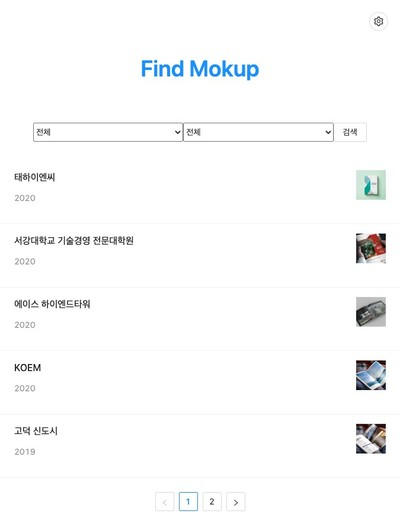
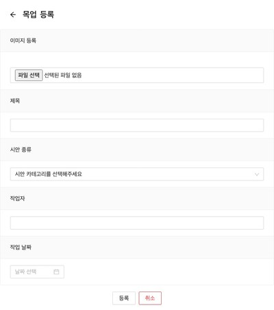

# Find MokUp

내가 작업했던 디자인 시안을 올려두어 년도별, 카테고리별로 나중에 쉽게 찾자!




## 주요 기능

- [ ✓ ] 로그인, 로그아웃
- [ ✓ ] 년도별 필터 정렬
- [ ✓ ] 카테고리별 필터 정렬
- [ ✓ ] 목업 등록 및 수정 삭제

## Stack

- React
- Redux
- Redux Saga
- Typescript
- Firebase

## Preview Demo

-[Preview](https://snapcheol.github.io/find-mokup)

**테스트 계정**

- id: guest@find-mokup.com
- pw: testtest

## 의존성 패키지 설치

```
$ npm install
```

```
$ yarn install
```

## 프로젝트 실행

```
$ npm start
```

```
$ yarn start
```
